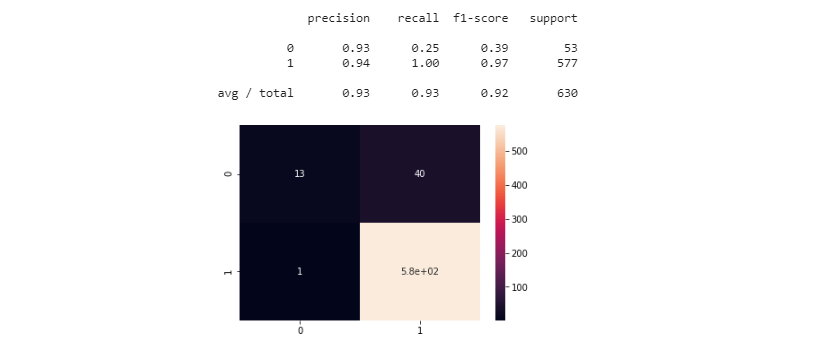
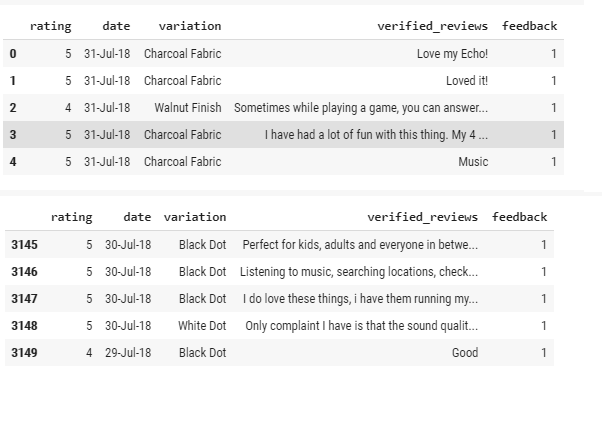
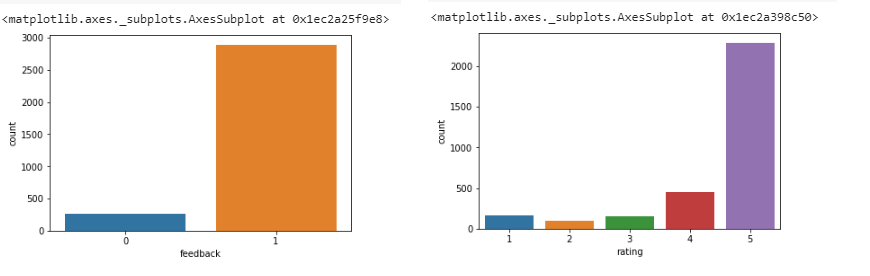
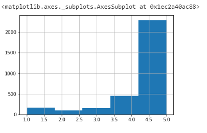
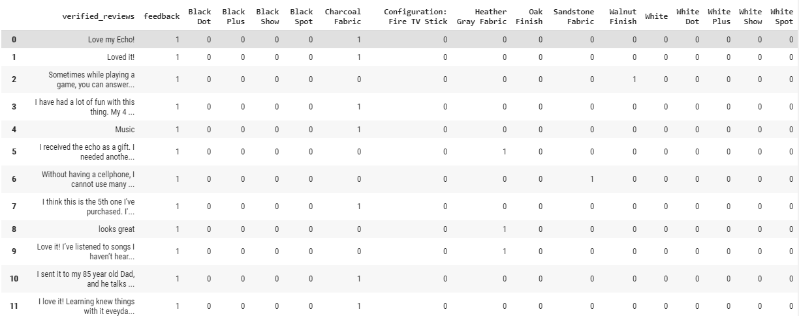
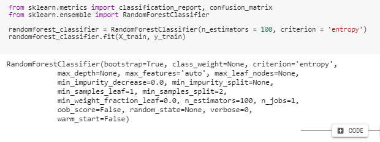
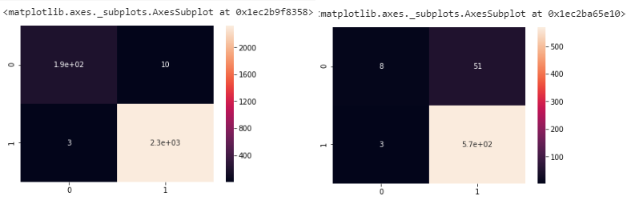

#### Machine Learning - Decision Trees

# Amazon--AlexaDecisonTree

# Background

Running a targetted marketing ads on facebook. The company wants to anaylze customer behaviour by predicting which customer clicks on the advertisement. Customer data is as follows:

Inputs:

* Name
* e-mail
* Country
* Time on Facebook
* Estimated Salary (derived from other parameters)

# Goals

* Split the data in Train and Test
* Train and Test the model in the data set
* Visualize
* Predict Click on the ad

# How to run 

Open Google Colab https://colab.research.google.com/
* File
* Upload Notebook
* Run the Cells

# Proccess

Import the data set and visualize the data

* With Scatter plot
#  

* With Box plot
#  

* With Histogram
#  

Transforming the data and Executing a training Test 
#  

With Confusion Matrix, checking on the accuracy
#  

ploting the boundary using the trained classifier
* Run the classifier to predict the outcome on all pixels with resolution of 0.01
* Colouring the pixels with 0 or 1
* If classified as 0 it will be magenta, and if it is classified as 1 it will be shown in blue 
#  

Ploting all the actual training points
#  

Visualising the Training set results for Tran and Test
#  

