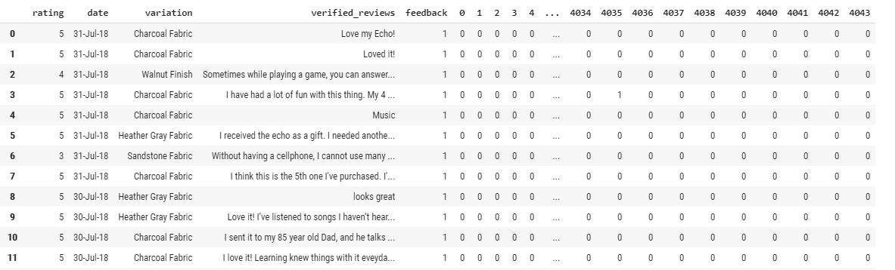

#### Machine Learning - Decision Trees

# Amazon--AlexaDecisonTree

# Background

Dataset consists of 3000 Amazon customer reviews, star ratings, date of review, variant and feedback of various amazon Alexa products like Alexa Echo, Echo dots.

* Dataset: www.kaggle.com/sid321axn/amazon-alexa-reviews

# Goals

* Discover insights into consumer reviews and perfrom sentiment analysis on the data.
* Split the data in Train and Test
* Train and Test the model in the data set
* Visualize
* Predict Click on the ad

# How to run 

Open Google Colab https://colab.research.google.com/
* File
* Upload Notebook
* Run the Cells

# Proccess

Import the data set and visualize the data

* Data set
#  

* Reviews
#  

* Visualizing data points
#  

Histogram (bins=5)
#  

Transforming the data
* Drop collumns
* Apply Dumies at Variation Collumn
* Add the encoded column again
* Concatenate them together
#  

ploting the boundary using the trained classifier
* Run the classifier to predict the outcome on all pixels with resolution of 0.01
* Colouring the pixels with 0 or 1
* If classified as 0 it will be magenta, and if it is classified as 1 it will be shown in blue 
#  

Ploting all the actual training points
#  

Visualising the Training set results for Tran and Test
#  

